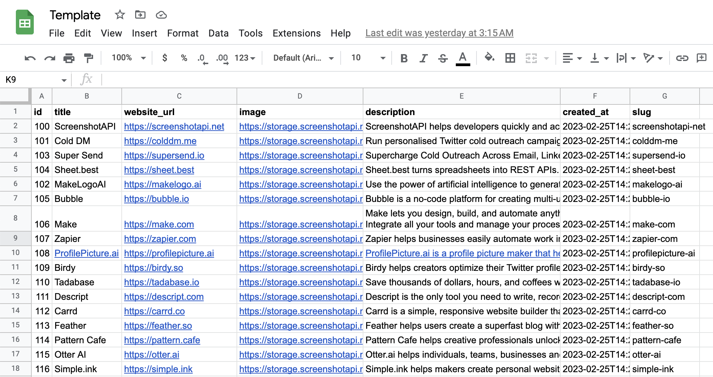

<p align='center'>
    
</p>
<p align='center'>
Starter template to create a SEO optimised content directory site using Nextjs and <a href="https://sheet.best/?ref=template">sheet.best</a>
</p>

<hr />

- [x] Uses sheet.best for adding/updating the listings using Google Sheets
- [x] SEO Optimised
- [x] Sitemap generated using next-sitemap
- [x] Tailwind CSS

## Initial Setup

1. Prepare a spreadsheet (Google Sheet)



Make a copy of [this](https://docs.google.com/spreadsheets/d/1L8OuWcNuf4h0HgKkW_g_ZCfjDdPevEZ_yPih1FXsrpg/edit?usp=sharing)

Read more [here](https://sheetbestdocs.netlify.app/#welcome)

2. Create a [Sheet best](https://sheet.best/) account and obtain your connection URL

Instructions [here](https://sheetbestdocs.netlify.app/#how-to-prepare-your-sheet)

3. Next, copy .env.example to .env and replace the .env file with your environment variables.

```bash
cp .env.example .env
```

4. Install all the dependencies:

```bash
npm install
# or
yarn install
```

## Development Workflow

Run the development server:

```bash
npm run dev
# or
yarn dev
```

Open [http://localhost:3000](http://localhost:3000) with your browser to see the result.

You can start editing the page by modifying `src/pages/index.js`. The page auto-updates as you edit the file.

## Deploy on Vercel

The easiest way to deploy your Next.js app is to use the [Vercel Platform](https://vercel.com/new?utm_medium=default-template&filter=next.js&utm_source=create-next-app&utm_campaign=create-next-app-readme) from the creators of Next.js.

Check out our [Next.js deployment documentation](https://nextjs.org/docs/deployment) for more details.

## Deploy on AWS using Amplify

You can use AWS Amplify to deploy the app as well https://aws.amazon.com/blogs/mobile/amplify-next-js-13/

Awesome! Now you're ready to manage your website using a Google Sheets.
